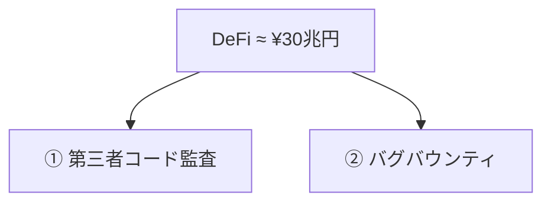

# 30兆円を守る二本柱は今も機能するか

第三者によるコード監査(事前点検) ＋ バグバウンティ(発見者への報奨金) — 防衛は実質この二本だけ

本当に機能しているか?

<!--
Speaker Notes:
DeFi、つまり分散金融は、現在およそ30兆円規模の資金フローを支えています。しかしこの巨大な金融インフラを守る防衛機構は、たった二本の柱しかありません。一つは『第三者によるコード監査』、もう一つは『バグバウンティ・プログラム』です。伝統金融に存在する監督官庁、戻し処理、サポートデスク、預金保険、そのいずれも基本的に存在しません。本セッションの問いはシンプルです。この二本柱は、本当にまだ機能しているのでしょうか。これが、続くActs 2と3、合わせて14枚のスライドで答えていく質問です。
-->
