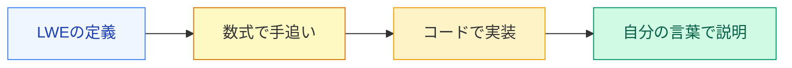

# TFHEはどうやってこの壁を破ったのか

今日この4ステップを完走する

<!--
Speaker Notes:
前のスライドで確認した通り、この問いは31年間誰も解けなかった。では、どうやって解かれたのか？2009年、Craig Gentryが格子暗号をベースにしたBootstrappingを発明し、初めて完全準同型暗号の具体的な構成を示した。しかしそのGentryの方式は非常に遅く、1つのゲート演算に数時間かかっていた。実用的とは程遠かった。2016年のTFHE（Torus FHE）はその壁を突破し、1回のBootstrappingをミリ秒単位で実行できるようにした。今日あなたがすることは、このTFHEの仕組みを「なんとなく分かった」レベルで終わらせないことだ。LWEの定義から始めて、Blind Rotation・Sample Extraction・Key Switchingの三つのサブアルゴリズムを数式で手追いし、最終的にHomNANDと全加算器をコードで実装する。これは数学の講義ではなく、あなたが自ら手を動かして暗号を操る実践の場だ。
-->
