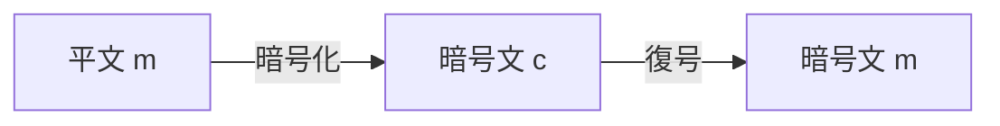

# 暗号方式の定義

## 暗号方式(Encryption Scheme)の定義

3つの（確率的）多項式時間アルゴリズムの組み(Gen, Enc, Dec)

- Gen$(1^\lambda)\to key$:
  - 鍵を出力する（鍵生成）
- Enc$(m, key_{enc})\to c$:
  - 平文と鍵から暗号文を出力する（暗号化）
- Dec$(c, key_{dec})\to m$:
  - 暗号文と鍵から平文を出力する（復号）

が$\text{Dec}(\text{Enc}(m))=m$を満たす時、暗号方式と呼ばれる。
 

 

## 共通鍵暗号と公開鍵暗号

- 共通鍵暗号(Symmetric Key Encryption): EncとDecで同じkeyを用いる。
- 公開鍵暗号(Public Key Encryption): Genで鍵のペア(pk,sk)を生成し、pk(公開鍵)が暗号化に使われsk(秘密鍵)が復号に使われる。
