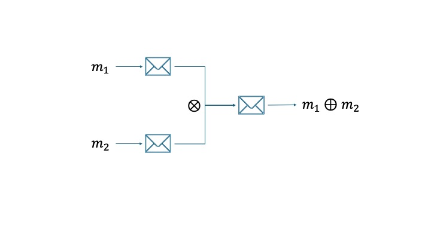

<!--足し算や掛け算を使った具体例を入れる-->

# Homomorphic Encryption

## 準同型暗号(Homomorphic Encryption)=暗号文のまま計算できる暗号

	

	平文に対して演算 <MathInline expr="\oplus" />  ,暗号文に対して演算<MathInline expr="\otimes"/>が可能なとき、 
	2つの暗号文<MathInline expr="c_1=Enc(m_1), c_2=Enc(m_2)"/>に対して、<MathInline expr="Dec(c_1 \otimes c_2)=m_1 \oplus m_2"/>が成立する
	
 

> 例：RSA暗号の暗号文同士を掛け算して復号すると平文同士の掛け算になる。

	

		
	

> note:
>
> - RSA暗号やElgamal暗号は暗号文同士の乗算が平文同士の乗算になり、Paillier暗号は暗号文同士の乗算が平文同士の加算になる
> - 暗号文の状態での演算を準同型演算と呼ぶ。
