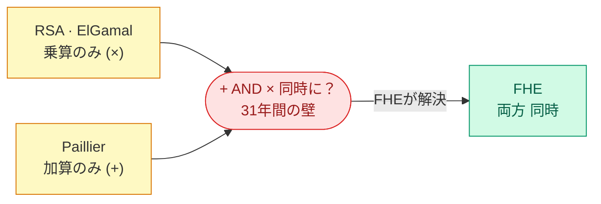

# RSA（×のみ）・Paillier（+のみ）は「片方」を実現した——「両方同時」が31年間の壁だった

PHE（部分準同型暗号）= 片方の演算のみ対応

<!--
Speaker Notes:
面白いことに、「片方だけ」の準同型演算は実は古くから知られていた。RSA暗号は乗法準同型を持つ——Enc(m1) × Enc(m2) を計算すると Enc(m1 × m2) になる。Elgamal暗号も同様だ。Paillier暗号は加法準同型を持つ——Enc(m1) + Enc(m2) を計算すると Enc(m1 + m2) になる。これらを「部分準同型暗号（Partially Homomorphic Encryption、PHE）」と呼ぶ。では「加算と乗算の両方を同時に」実現できれば、任意の計算ができるはずだ。なぜなら、加算と乗算はすべての算術の基本演算だからだ。しかし、ここに31年間破れなかった壁がある。IND-CPA安全性（選択平文攻撃安全性）は、暗号文が平文について何も漏らさないことを要求する——しかしこれは、暗号文に代数構造を持たせることと矛盾するように思えた。暗号文に構造を持たせれば計算できる。しかし構造があれば情報が漏れる。この見かけ上の矛盾が、31年間の空白の原因だった。
-->
