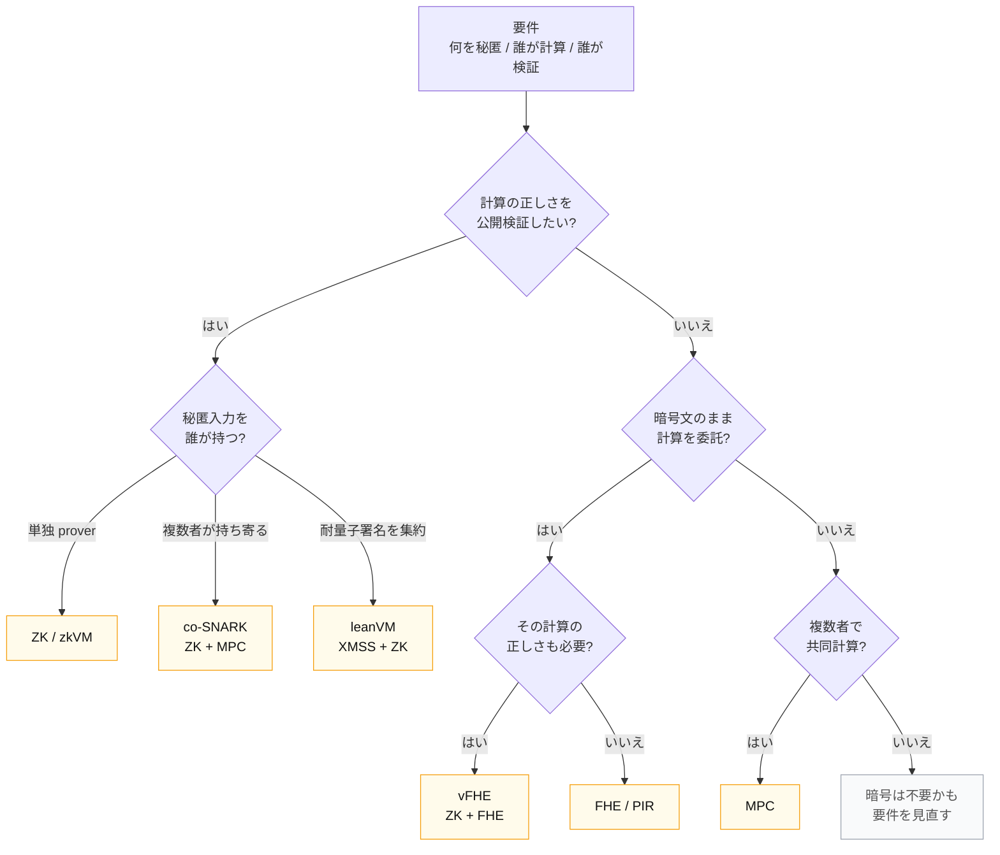

# 設計フローチャート

要件 (何を秘匿 / 誰が計算 / 誰が検証) を入れると、必要な primitive と合成が決まる。

Sources: 本講義の合成例 (SL05) ｜ 設計の語彙は gubsheep "Programmable Cryptography" 0xPARC (2024) に基づく

<!--
Speaker Notes:
本日の中核。要件を起点に primitive を選ぶ決定木。最初の分岐は「計算の正しさを公開検証したいか」。はい → 秘匿入力を誰が持つかで ZK / co-SNARK / leanVM に分かれる。いいえ → 暗号文のまま委託するなら FHE、正しさも要るなら vFHE、複数者で共同計算なら MPC。どの枝にも当てはまらなければ「暗号は不要かも」= 要件を見直す。重要なのは「正しさ」と「秘匿」を別軸で問うこと。WS ではこの木を各自の設計に適用する。完璧な分類ではなく出発点として使う。
ANIM候補: 要件入力 → 各分岐をたどって primitive がハイライトされる流れは animated-concept-slide で morph 化可能。
-->
