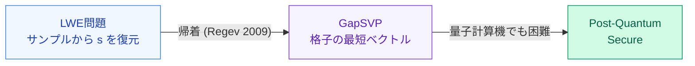

# LWEは量子計算機にも安全——GapSVPへの帰着が保証する

RSA・楕円曲線は量子計算機（Shorのアルゴリズム）で破られる——格子問題は量子後も困難と信じられている

Sources: Regev "On Lattices, Learning with Errors, Random Linear Codes, and Cryptography" J. ACM 2009 [Reg09]

<!--
Speaker Notes:
TFHEの仕組みを理解する前に、まず「なぜTFHEを信頼できるのか」を確認しておこう。TFHEの安全性はLWE（Learning With Errors）問題の困難性に基づいている。LWE問題は何か？n次元のベクトル s（秘密鍵）に対して、多数のサンプル (a_i, b_i = <a_i, s> + e_i) が与えられたとき——ここで e_i は小さなノイズ——このsを求めるのが難しいという問題だ。重要なのは、LWE問題の困難性は最悪ケース格子問題——GapSVP（格子の最短ベクトル問題の決定版）——への帰着（reduction）によって保証されていることだ。これはRegev（2009年）が証明した。この帰着が何を意味するか：もしLWEが効率的に解けるなら、最悪ケースのGapSVP——すべての格子に対して最短ベクトルを効率的に見つける問題——も解けることになる。これは量子計算機でも解けないと信じられている問題だ。RSAや楕円曲線暗号が量子計算機（Shorのアルゴリズム）によって破られるのと対照的に、格子問題は量子後安全（Post-Quantum Secure）だ。
-->
