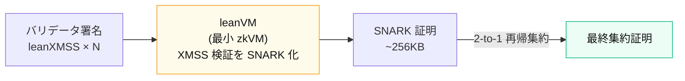

# A. zkVM ④

BLS は量子耐性なし → ハッシュベースの <strong>leanXMSS</strong> へ。だが XMSS は<strong>ネイティブ集約不可</strong> → zkVM で集約する。

コンセンサス層 (CL) &mdash; leanVM

&#9654;KoalaBear field / <strong>Poseidon2</strong> / commitment <strong>WHIR</strong> (FRI 改良)

&#9654;1,000 XMSS sigs/秒 ・ 再帰集約 ~200ms ・ 128-bit

実行層 (EL) &mdash; RISC-V

&#9654;Vitalik 2025-04: EVM を <strong>RISC-V で直接置換</strong>

&#9654;ZK 証明効率 100倍超 / 形式検証が容易

⚠ CL の安全性は Poseidon2 / WHIR (hash = PQ-secure) の堅牢性に帰着 → 形式検証 $20M (Lean 4) ・ Proximity Gap Prize $1M。数値・時期 (2029 目標) は研究/ロードマップ段階。

Sources: Lean Consensus 2026 plan (hackmd @tcoratger) ｜ leanXMSS (IACR ePrint 2025/055, 2025/1332) ｜ Vitalik "RISC-V for EVM" (2025-04) ｜ zkEVM Formal Verification Project (Veridise) ｜ EF Proximity Gap Prize

<!--
Speaker Notes:
【ゴール】「Ethereum の量子耐性獲得に zkVM が使われている」ことを具体ロードマップで示す。leanVM は zkVM のユースケースであると同時に、Ethereum が PQ 化する手段そのものが zkVM だという最重要事例。
【集約問題】BLS の最大の利点はネイティブ集約 (数千署名を 1 つに)。leanXMSS はハッシュベースで量子耐性だが、この集約機能を持たない。各 slot で大量のバリデータ署名を扱う Ethereum では集約が必須。
【解】最小 zkVM (leanVM) 上で XMSS 検証を SNARK 証明し、2-to-1 で再帰集約する (leanMultisig)。図を左から右へ。
【鍵】CL 全体のセキュリティが Poseidon2 / WHIR という hash ベース commitment に帰着する。だから $20M の形式検証と $1M Prize が正当化される。数値・2029 目標は未確定の論点を含む旨を添える。EL 側は Vitalik の EVM→RISC-V 提案で補完。
ANIM候補: N 署名 → leanVM → SNARK → 2-to-1 再帰集約のフローは animated-concept-slide で morph 化可能。
-->
