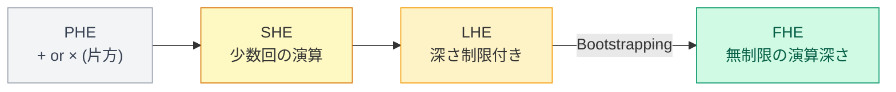

# PHE→SHE→LHE→FHE——Bootstrappingだけが無制限の演算深さへの扉を開ける

BootstrappingがないとLHEで止まる——無制限の演算深さはBootstrappingだけが与える

<!--
Speaker Notes:
FHEの世界には段階的なカテゴリが存在する。まず部分準同型暗号（PHE）——RSA（乗算のみ）やPaillier（加算のみ）がこれにあたる。次に限定的準同型暗号（SHE: Somewhat Homomorphic Encryption）——加算も乗算も少ない回数なら評価できる。さらにレベル準同型暗号（LHE: Leveled HE）——Bootstrappingを使わずに、パラメーターで規定した深さの演算を評価できる（BFV、BGV、CKKSはLHEとして運用されることが多い）。そして完全準同型暗号（FHE）——Bootstrappingを使って、理論上無制限の深さの演算を評価できる。SHEからFHEへのジャンプを阻んでいるのは「ノイズの蓄積」だ。LWE暗号文には常にノイズが含まれており、演算を重ねるたびにノイズが大きくなる。加算はノイズを線形に増やし、乗算はノイズを指数的に増やす。ノイズが「最大許容値」を超えると復号が不可能になる。これがSHEの「壁」だ。Bootstrappingはこのノイズをリセットするメカニズムで、これがあって初めてFHEが実現する。
-->
