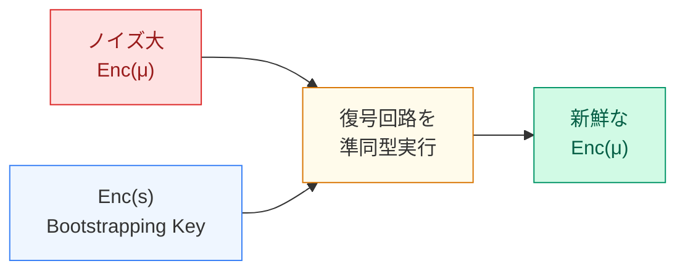

# Gentryの洞察：復号回路を暗号文のまま評価すればノイズをリセットできる

逆説——ノイズを除くために、ノイズのある暗号文を暗号文のまま計算する

<!--
Speaker Notes:
2009年、Craig Gentryは非常に逆説的なアイデアを提案した。ノイズが大きくなりすぎた暗号文をリフレッシュする方法として、「復号回路自体を暗号文のまま評価する」というアプローチだ。これを「Bootstrapping」と呼ぶ。直感的に理解してみよう。あなたは暗号文 c を持っている。c は秘密鍵 s で復号すると平文 μ が得られる——しかしノイズが大きすぎて今すぐは復号できない。Gentryのアイデア：s を暗号化した暗号文 Enc(s)（Bootstrapping Key）を事前に準備する。そして、Enc(c)（暗号文 c を暗号文で再暗号化したもの）と Enc(s) から、復号回路を「準同型に実行」する。つまり Dec(Enc(c), Enc(s)) を暗号文のまま計算する。この計算の出力は Enc(μ)——平文 μ の新鮮な暗号文だ。この新鮮な暗号文はノイズが初期化されている（Bootstrapping過程でのノイズは制御されているから）。逆説的なのは「ノイズを取り除くために、ノイズのある暗号文を暗号文のまま計算している」点だ——しかしこれが機能する。
-->
