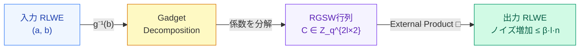

# RGSW暗号文 — Gadget Decompositionでノイズを封じる

  
CMUXはExternal Productで実装される——RGSWの行列形式がノイズ爆発を多項式係数のバウンドに抑える

<!--
Speaker Notes:
Blind Rotationが使うCMUX演算の基礎を理解するために、RGSW暗号文とGadget Decompositionを見ておこう。

Gadget Decompositionとは何か？基数Bを使ってmod q上の値rを r = r_0·(q/B) + r_1·(q/B²) + ... + r_{l-1}·(q/B^l) と分解する操作だ。ガジェットベクトル g = (1, B, B², ..., B^{l-1}) を使えば g^{-1}(r) = (r_0, r_1, ..., r_{l-1}) と書ける。各 r_i は 0 ≤ r_i < B の「小さな」整数になる。これがノイズ制御の鍵だ。

RGSW暗号文 C は「RLWE暗号文のリスト」として構成される。C ∈ Z_q^{2l×2} の行列だ。External Product（□）の計算は C □ ct = g^{-1}(ct) · C の形を取る——ここで ct は RLWE暗号文だ。重要なのは、g^{-1} を適用することでオペランドの係数を「小さくする」ことだ。結果のノイズは β·l·n 程度に制御される（βは各 r_i の最大値 ≈ B/2）。つまり、RGSW演算1回のノイズ増加は「多項式係数のバウンド以下」に抑えられる。これがBlind Rotation全体でのノイズを制御する設計的な理由だ。次のスライドで見るCMUX（暗号化された選択演算）はこのExternal Productで実装される。

具体例：B=4, l=3, q=64 のとき、r=47 の Gadget Decomposition は g^{-1}(47) = (1, 0, 15) だ（47 = 1·16 + 0·4 + 15·1）。
-->
