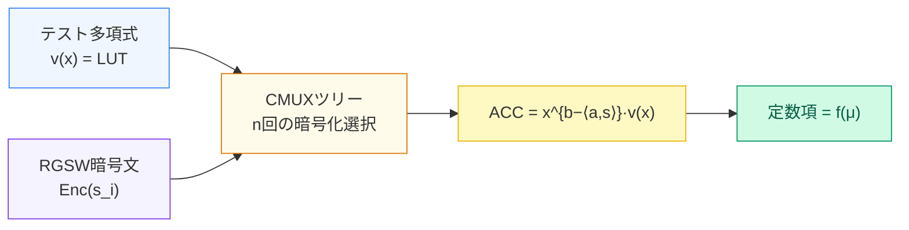

# Blind Rotation：CMUXツリーが任意の一変数関数を暗号文に埋め込む

秘密鍵 s は一度もクリアテキストで使われない

Sources: Chillotti, Gama, Georgieva, Izabachène "TFHE: Fast Fully Homomorphic Encryption over the Torus" J. Cryptology 2020 [CGGI16]

<!--
Speaker Notes:
TFHEのBootstrappingは3つのサブアルゴリズムから成る。まず第1ステップのBlind Rotationを見てみよう。入力はノイズの大きいLWE暗号文 c = (a, b) と、テスト多項式 v(x) だ。v(x) は「ルックアップテーブル」として機能する。例えばNAND関数を埋め込みたい場合、v(x) の係数に NAND の真理値表を配置する。アイデアは、v(x) を「b - <a,s>」だけ回転させることだ。この回転量 b - <a,s> は平文 μ を含んでいるが、a と s はそれぞれ公開されているかRGSW暗号文で保護されている。CMUX（暗号化された選択）演算を使うと、RGSW 暗号文（秘密鍵ビット s_i の暗号文）によって条件分岐を暗号文のまま行える。n回のCMUX演算を連鎖（CMUXツリー）させることで、v(x) を b - <a,s> だけ回転させた多項式 ACC = x^{b-<a,s>} · v(x) が得られる。この ACC の定数項（x^0 の係数）に、平文 μ に応じた f(μ) の値が入る——これが「任意の一変数関数を暗号文に埋め込む」という意味だ。秘密鍵 s は一度もクリアテキストで使われていない。
-->
