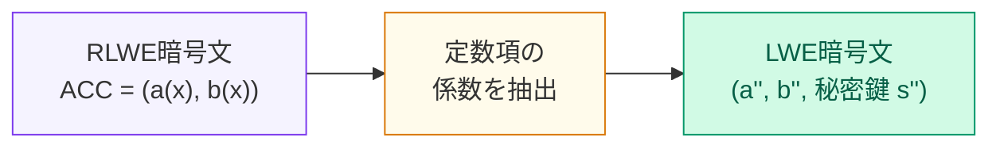

# Sample Extraction：RLWE多項式の定数項を新鮮なLWE暗号文として取り出す

  
コスト ≈ ゼロ ── 係数の読み替えだけ（追加の計算なし）

  
Key Switching（次のサブアルゴリズム）

  

    
&#9654; 鍵 s'' → s の線形変換

    
&#9654; コスト ≈ Sample Extraction と同等

    
&#9654; 変換行列 KSK を事前計算

  

<!--
Speaker Notes:
Blind Rotation の出力は RLWE 暗号文 ACC——多項式の暗号文だ。しかし私たちが欲しいのは LWE 暗号文——スカラーの暗号文だ。この変換を行うのが Sample Extraction だ。RLWE 暗号文 ACC = (a(x), b(x)) は、多項式 a(x) = a_0 + a_1 x + ... + a_{N-1} x^{N-1} と b(x) からなる。RLWE の暗号化関係は b(x) = a(x) · s(x) + e(x) + μ(x) だ。定数項（x^0 の係数）だけに注目すると：b_0 = <(a_0, -a_{N-1}, -a_{N-2}, ..., -a_1), (s_0, s_1, ..., s_{N-1})> + e_0 + μ_0 という形になる（x^N ≡ -1 (mod x^N+1) という環の関係を使う）。これはまさに LWE 暗号文の形だ！つまり、RLWE 多項式の係数を適切に並び替えるだけで、定数項 μ_0 の LWE 暗号文が得られる。この新しいLWE暗号文の秘密鍵は s(x) の係数ベクトル s'' = (s_0, ..., s_{N-1})。Sample Extraction は追加の計算をほぼ必要とせず、Blind Rotation の出力を LWE 世界に橋渡しする。Key Switching（最後のサブアルゴリズム）はこの s'' を元のLWE秘密鍵 s に変換する線形変換で、KeySwitchingKey（KSK）= {Enc_s(s''_i)} を事前生成して使う。コストはSample Extractionと同等だ。
-->
