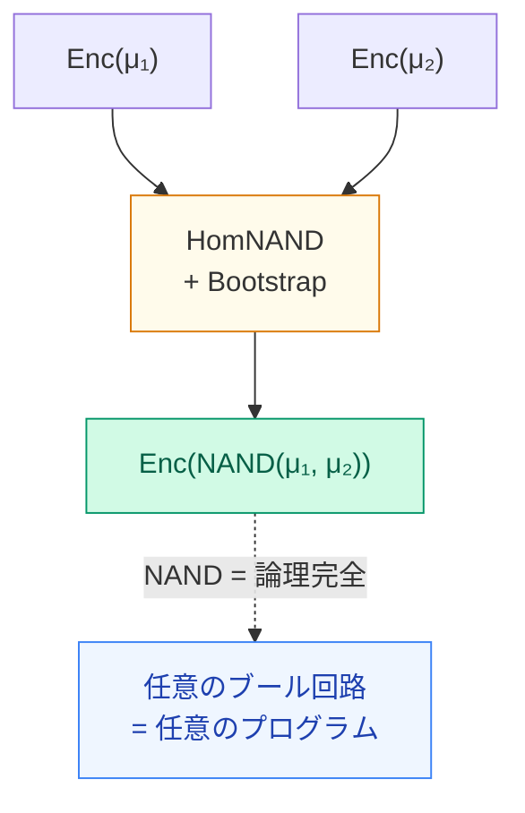

# HomNAND + NAND完全性——任意のブール回路が暗号文のまま評価できる

NANDさえあれば AND・OR・NOT・XOR——任意の論理関数が暗号文のまま動く

<!--
Speaker Notes:
ここで大きな絵に戻ろう。TFHEはなぜ「任意のプログラムを暗号文のまま評価できる」と言えるのか？まず、HomNANDを理解しよう。TFHEでは、LWE暗号文で表現された2ビット μ_1、μ_2 に対して、NAND(μ_1, μ_2) を計算しつつ同時にBootstrappingを行うHomNANDが実装できる。具体的には：c_out = (5/8) - c_1 - c_2 を計算してBootstrappingをかける（テスト多項式にNAND真理値表を埋め込む）。これで Enc(NAND(μ_1, μ_2)) の新鮮な暗号文が得られる。なぜNANDが重要か？NANDは論理完全（functionally complete）だ。つまりNANDゲートだけでAND、OR、NOT、XOR、任意の論理関数を表現できる。任意の論理関数 → 任意のデジタル回路 → 任意のプログラム（チューリング機械で計算可能なものはすべて）。だから「TFHEはチューリング完全な暗号」だと言える。全加算器も、乗算器も、ニューラルネットワークも、データベースクエリも——すべてHomNANDの組み合わせで、暗号文のまま実行できる。
-->
