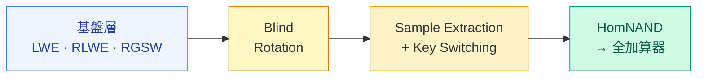

# 今日の実装：LWE→RLWE→RGSW→Blind Rotation→HomNAND→全加算器

各ステップは前のステップに依存——コードが動いたとき、それが理解の証明

<!--
Speaker Notes:
実装課題の構造を説明しよう。課題はFHEの概念的な依存順序に従って設計されている——つまり、今日学んだ理論の流れがそのままコードの流れになっている。まずLWE暗号：暗号化・復号・加算・スカラー乗算を実装する。これがすべての基盤だ。次にRLWE暗号：多項式環上の暗号化と演算を実装する。この上にGadget Decompositionを使ったRGSW暗号を実装する。そしてExternal Product（RGSW × RLWE）とCMUXを実装する——これがBlind Rotationの心臓部だ。Blind Rotation全体 → Sample Extraction → Key Switching を順に実装する。これが揃ったらHomNANDを実装し、最後にHomNANDを組み合わせて全加算器（1ビット加算：3入力 → Sum + Carry）を作る。各ステップは前のステップに依存している——順番を変えて実装することはできない。これは設計の一部だ：あなたが各ステップを正しく理解していなければ次のステップが動かないようになっている。コードが動いたとき、それは「理解の証明」だ。
-->
