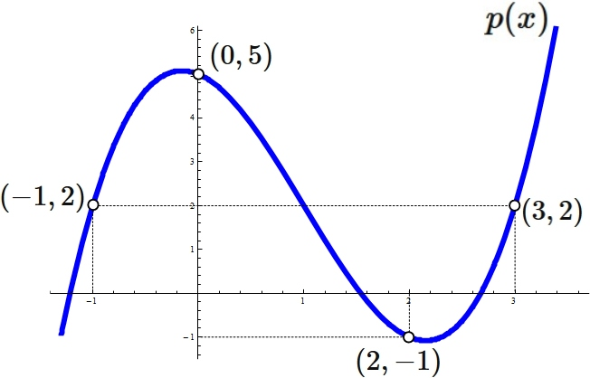

# Part 3: 秘密分散

<ChapterMap :current="3" />

<!-- ## 目的

MPC の中心的な技術である秘密分散を理解する。

ここでは、MPC のすべてのプロトコルを説明するのではなく、次の直感を作る。

```text
secret を share に分ける
share 単体では secret が分からない
share のまま計算できるものがある
必要なときだけ output を復元する
``` -->

---
layout: default
class: secret-sharing-intro
---

# 秘密分散とは？

秘密分散とは、秘密の値を複数の party に分散して持たせる技術である。

各 party には、秘密そのものではなく、ランダム性を使って作られた**share**という値が渡される。

そして、少数のshareだけでは秘密の値が分からないようにする。一方で、決められた数以上の shareを集めることで秘密の値を復元できる。

もう少し形式的には、SharingとReconstructの2つのアルゴリズムからなる。また、この講義では特にn個のshareの内k個以上が集まれば復元でき、k-1個以下では秘密の値が分からない**k-of-n threshold secret sharing**を中心に見る。

<div class="share-visual">
  <div class="share-node">secret<br>x</div>
  <div class="share-arrow">→</div>
  <div class="share-stack">
    <span>[x]₁</span>
    <span>[x]₂</span>
    <span>[x]₃</span>
  </div>
  <div class="share-arrow">→</div>
  <div class="share-result">k 個以上で<br>reconstruct</div>
  <p class="share-caption">各 share 単体では secret は分からない。決められた数が集まったときだけ復元できる。</p>
</div>

---
layout: two-cols-header
class: dense-two-col additive-example
---

# 例:加法的秘密分散

::left::

まず、最も直感的な例として **加法的秘密分散** を見る。加法的秘密分散では、secret を複数の share に分け、すべての share を足すと secret に戻るようにする。

有限体 mod p 上で secret x を n 個の share に分ける。

mod p は、p で割った余りだけを見る世界だと考えればよい。

```text
x = share_1 + share_2 + ... + share_n mod p
```

sharingは例えば次のようにできる。

```text
share_1, ..., share_{n-1} をランダムに選ぶ
share_n = x - share_1 - ... - share_{n-1} mod p
```

また、reconstructは全てのshareを足すだけである。
```text
x = share_1 + share_2 + ... + share_n mod p
```

::right::

例:

```text
p = 101
x = 42

share_1 = 17
share_2 = 60
share_3 = 66

17 + 60 + 66 = 143
143 mod 101 = 42
```

このとき、それぞれの share はランダムに見える。

```text
P1 sees share_1 = 17
P2 sees share_2 = 60
P3 sees share_3 = 66
```

1つの share だけを見ても、元の secret が 42 だったとは分からない。より一般に、基本的な加法的秘密分散では、n-1 個以下の share からは secret が分からない。

その代わり、復元には n 個すべての share が必要になる。
つまり、基本的な加法的秘密分散は n-of-n の秘密分散として理解できる。

---

# 加法的秘密分散の特徴

加法的秘密分散の大きな利点は、シンプルで、shareのまま加算・減算ができることである。

secret xがshareされた状態を[x]と書く。それぞれのshareは[x]_1, [x]_2, [x]_3のように書く。ここで1,2,3は各パーティの番号だと思えばよい。
```text
[x] = ([x]_1, [x]_2, [x]_3)
[y] = ([y]_1, [y]_2, [y]_3)
```

このとき、x+yがshareされた状態は次のように表せる。

```text
[x + y] = ([x]_1 + [y]_1, [x]_2 + [y]_2, [x]_3 + [y]_3)
```

すなわち、各 party は、自分の share だけをローカルに足せばよい。

**secret を復元する必要はなく、通信も不要である。**

この性質により、合計・平均・線形変換は MPC と相性がよい。

一方で、基本的な加法的秘密分散では復元に全 share が必要になる。
次に、「何個の share が集まれば復元できるか」という軸を見る。

---

# 復元条件: なぜ k-of-n が欲しいのか

基本的な加法的秘密分散は、すべての share が必要な **n-of-n** として理解できる。

```text
n-of-n:
  n 個すべての share が必要
  1 個でも欠けると復元できない
```

しかし、n-of-n だけでは運用上つらい場面がある。

```text
全員が毎回オンラインでないと復元できない
1つの share を失うと復元できない
一部の party が止まると output が得られない
```

そこで、より柔軟な復元条件として **k-of-n** を考える。

```text
k-of-n:
  n 個のうち k 個あれば復元できる
  k - 1 個以下では secret が分からない
```

これが **k-of-n threshold secret sharing** の考え方である。

この復元条件を自然に実現する代表例が、Shamir 秘密分散である。

---
layout: two-cols-header
class: shamir-intuition-slide
---

# Shamir の直感: 点が足りないと多項式が定まらない

::left::

Shamir 秘密分散の直感は、多項式を点から復元することである。

```text
1点だけでは、どの直線か分からない
2点あれば、直線が決まる

2点だけでは、どの2次多項式か分からない
3点あれば、2次多項式が決まる
```

一般に、**k 個の点があれば、次数 k - 1 の多項式が一意に定まる**。

secret は q(0)、つまり多項式の切片に置く。
十分な数の点が集まれば、多項式が決まり、q(0) が分かる。
点が足りなければ、q(0) はまだ決まらない。正確には、同じ k-1 個の点を通りながら、q(0) が別の値になる多項式がまだ作れてしまう。

::right::

<figure class="shamir-interpolation-figure">
  
  <figcaption>4点が与えられると、3次多項式 p(x) が一意に定まる</figcaption>
</figure>

---
layout: two-cols-header
class: dense-two-col shamir-formal
---

::left::


# Shamir の秘密分散法

Shamir の秘密分散法では、secret を多項式の切片に埋め込む。

```text
q(0) = secret
```

secret は q(0) にあるが、party には q(0) そのものは渡さない。

ここでも、計算は有限体 mod p 上で行う。

復元に k 個の share が必要な場合、次数 k-1 のランダム多項式を使う。

```text
q(z) = secret + a1 z + a2 z^2 + ... + a_{k-1} z^{k-1}
```

各 party には、多項式上の点を渡す。

```text
P1 receives q(1)
P2 receives q(2)
P3 receives q(3)
...
Pn receives q(n)
```

::right::

次数 k-1 の多項式は、k 個の点があれば決まる。
```text
k 個の share:
  多項式 q(z) を復元できる
  切片 q(0) として secret が分かる

k - 1 個以下の share:
  多項式 q(z) が一意に決まらない
  secret は分からない
```

---

# 加法的秘密分散と Shamir の比較

| 観点 | 加法的秘密分散 | Shamir 秘密分散 |
|---|---|---|
| 直感 | 足すと戻る | 通る点から多項式を戻す |
| 復元条件 | 基本形は n-of-n | k-of-n |
| 加算・減算 | 軽い | 軽い |
| 乗算 | 追加処理が必要 | 追加処理が必要 |

---

# MPCでの使い方: 何を opening してよいかを設計する

秘密分散は、それ単体で終わる技術ではない。  
MPC においては、secret を share に分けたあと、できる限り share のまま計算を進める。

secret そのものや意味のある中間値を不用意に opening すると、入力に関する情報が漏れる可能性がある。
そのため、MPC では share のまま計算を進め、設計上 opening してよい値や安全にマスクされた値だけを復元する。

したがって、MPC では基本的に、

```text
secret
  ↓ sharing
share
  ↓ share のまま計算
output share
  ↓ 許可された output だけopeningする
output
```

という流れで考える。


<TermNote term="opening" description="秘密分散において、share を集めて secret を復元すること。" />

---
layout: default
class: representation-slide
---

# エンジニア視点: 現実の値をどう扱うか

給与、年齢、金額、確率、小数などの現実の値を、MPC の中でそのまま扱えるわけではない。

多くの MPC では、計算対象を有限体や環(例えば64bit整数など)上の値として表現する。

```text
入力、現実の値
  ↓ encode
有限体 / 環 / 固定小数点表現
  ↓ sharing
share
  ↓ MPC protocol
output share
  ↓ opening
encoded output
  ↓ decode
出力
```

このため、実装では次のような論点が出る。

- 値の範囲をどう決めるか
- 負の数をどう表すか
- 小数を固定小数点としてどうスケールするか
- overflow や丸めをどう扱うか

講義本編では詳細な符号化方式には踏み込まない。

ただし、MPC を使うには「計算したい値や関数をどの表現にするか」を設計する必要がある。
