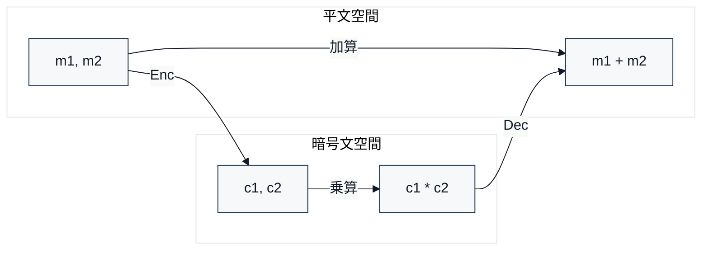

# [直感] 暗号文上で計算するということ

暗号文を復号せずに演算して、最後に復号したときだけ結果が見える。

```mermaid
%%{init: {'theme': 'base', 'themeVariables': {'primaryColor': '#f7f8fa', 'primaryBorderColor': '#17324d', 'primaryTextColor': '#111827', 'lineColor': '#111827'}}}%%
flowchart LR
  subgraph P["平文空間"]
    direction LR
    A["m1, m2"] -->|加算| B["m1 + m2"]
  end
  subgraph C["暗号文空間"]
    direction LR
    D["c1, c2"] -->|乗算| E["c1 * c2"]
  end
  A -->|Enc| D
  E -->|Dec| B
```

> **見るべきポイント**
> 平文側の演算と暗号文側の演算が対応している。FHEでは加算と乗算の両方を暗号文上で扱えるようにしたい。

FHEの中心課題は、計算したい関数を表現しながら、復号可能な範囲にノイズを保つことである。
