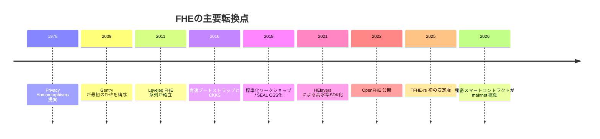

# week5補助教材

FHEに関するコミュニティ、ラブラリ、アプリケーション、年表について表で掲載します。

---

## コミュニティ

| 名称                                        | 区分         | 主要メンバー                                                                                           | 活動内容                                                                   | 公式サイト                                  | 注釈                                                                                                             | 出典                                                         |
| ------------------------------------------- | ------------ | ------------------------------------------------------------------------------------------------------ | -------------------------------------------------------------------------- | ------------------------------------------- | ---------------------------------------------------------------------------------------------------------------- | ------------------------------------------------------------ |
| HomomorphicEncryption.org                   | 団体         | Jung Hee Cheon、Kristin Lauter、Kurt Rohloff、Rachel Player、Ro Cammarota、Shai Halevi、Yuriy Polyakov | HE標準化、セキュリティ/API/応用ガイドライン、標準会合の運営                | HomomorphicEncryption.org                   | 標準化を主導する中核的な連携体。 研究者・企業・標準化関係者の接点として機能している。                         | https://homomorphicencryption.org/                           |
| FHE.org                                     | 団体         | 未指定                                                                                                 | FHE学習資源、Discord/Meetup/Conference、研究発表・録画・スライド共有       | FHE.org                                     | 標準化団体というより、開発者・研究者の開かれた実務コミュニティ。 教材・イベントの集積点としての価値が大きい。 | https://fhe.org/                                             |
| OpenFHE.org                                 | 団体         | David Cousins、Lloyd Greenwald、Yuriy Polyakov、Kurt Rohloff ほか                                      | OpenFHEのガバナンス、暗号チーム運営、リリース、メーリングリスト運営        | OpenFHE.org                                 | 実装プロジェクトそのものが独立したコミュニティ化している例。 研究・実装・運用判断をチーム制で回している。     | https://openfhe.org/                                         |
| OpenMined                                   | 団体         | Andrew Trask ほか                                                                                      | PET全般の教育、コース提供、研究コミュニティ形成、政策連携                  | OpenMined                                   | FHE専業ではないが、PET全体の入口として影響力が大きい。 FHEを含む教育・コミュニティ運営の受け皿として重要。    | https://openmined.org/                                       |
| Zama                                        | 団体         | Rand Hindi、Pascal Paillier、Nigel Smart、Marc Joye                                                    | FHE研究開発、OSS、秘密スマートコントラクト、ブロックチェーン向けプロトコル | Zama                                        | 研究組織と製品組織が一体化している。 特にTFHE系実装とブロックチェーン応用で存在感が大きい。                   | https://www.zama.org/                                        |
| Microsoft Research Cryptography Group       | 研究グループ | Radames Cruz Moreno、Kim Laine、Kristin Lauter                                                         | Microsoft SEAL、HE研究、PPML・ゲノム解析・標準化への関与                   | Microsoft Research                          | SEALを軸に、実装・応用・標準化をまたいで長く影響を持つ。 商用クラウド用途を見据えた実装志向が強い。           | https://www.microsoft.com/en-us/research/group/cryptography/ |
| IBM Research AI on Encrypted Data via FHE   | 研究グループ | Guy Moshkowich ほか HElayers/IBM Researchチーム                                                        | HElayers、FHE Cloud Service、暗号化AI、金融・医療応用                      | IBM Research                                | 実利用に近いAIワークロードへFHEを押し込む実装志向の強いグループ。 HElayersと事例公開がそろっている点が特徴。  | https://ibm.github.io/helayers/                              |
| FHE.org Conference                          | イベント     | 主催側主要メンバーは未指定                                                                             | 年次会議、論文/ポスター/動画/スライド公開、コミュニティ形成                | FHE.org Conference                          | FHE.org の知見が最もまとまって見える年次イベント。 研究と実装の中間にある話題が多い。                         | https://fhe.org/conferences/                                 |
| HomomorphicEncryption.org Standards Meeting | イベント     | Steering Committee 主導                                                                                | HE標準・セキュリティ・ツール・ベンチマーク・ハードウェアIFの議論           | HomomorphicEncryption.org Standards Meeting | 研究会ではなく標準化実務の場として見るべきイベント。 WGごとの論点が明確で、実装者に重要。                     | https://homomorphicencryption.org/standards-meetings/        |
| PriCon                                      | イベント     | Andrew Trask ほか                                                                                      | プライバシー技術全般の無料イベント。FHEを含むPET研究・実装の交流           | OpenMined PriCon                            | FHE専業イベントではない。 ただしPET横断でFHEの位置づけを掴むには有用。                                        | https://pricon.openmined.org/                                |

## ライブラリ

| 区分              | 名前           | 言語                           | ライセンス                               | 主要機能                                                     | 対応するFHEスキーム                                  | 成熟度/安定版                                             | 主要利用者/採用事例                                      | 公式リポジトリ                                    | 注釈                                                                                                 |
| ----------------- | -------------- | ------------------------------ | ---------------------------------------- | ------------------------------------------------------------ | ---------------------------------------------------- | --------------------------------------------------------- | -------------------------------------------------------- | ------------------------------------------------- | ---------------------------------------------------------------------------------------------------- |
| バックエンド/基盤 | Microsoft SEAL | C++                            | MIT                                      | 整数/近似数のHE、シリアライズ、複数環境向けビルド            | BFV、BGV、CKKS                                       | 安定版あり。v4.3.3 が公開。                               | EVA、TenSEAL の基盤。MSRは世界的採用を明言。             | https://github.com/microsoft/SEAL                 | 「使いやすい基盤」として今も最重要級。 TFHE系は非対応で、RLWE系中心。                             |
| バックエンド/基盤 | OpenFHE        | C++                            | BSD-2-Clause                             | 主要HE方式の実装、multiparty、PRE、scheme switching          | BGV、BFV、CKKS、DM(FHEW)、CGGI(TFHE)                 | 安定版あり。v1.5.1 が公開。                               | HEIR の既定バックエンド。OpenFHEコミュニティが継続運用。 | https://github.com/openfheorg/openfhe-development | 方式の幅が広く、研究実装から応用実装まで守備範囲が広い。 現行OSS基盤として最も包括的。            |
| バックエンド/基盤 | HElib          | C++                            | Apache-2.0                               | BGV/CKKS、packing最適化、ブートストラップ関連実装            | BGV、CKKS                                            | 安定版あり。v2.3.0 が公開。                               | 主要利用者は未指定。歴史的に代表的実装。                 | https://github.com/homenc/HElib                   | 最古参の一角で、学術・実装の橋渡し役。 最新の開発速度は新興系より緩やか。                         |
| バックエンド/基盤 | TFHE-rs        | Rust、C、WASM                  | BSD-3-Clause-Clear                       | Boolean/整数FHE、programmable bootstrapping、GPU/HPU backend | TFHE系                                               | 初の安定版 v1.0.0 は 2025年2月。直近 release は v1.6.0。  | Zama Protocol/fhEVM 系の基盤。                           | https://github.com/zama-ai/tfhe-rs                | TFHE系の実務実装で最重要。 ライセンスは BSD-3-Clause-Clear で、ZamaのIP方針には別途注意が必要。   |
| コンパイラ/IR     | Concrete       | Python フロント、LLVM/内部実装 | BSD-3-Clause-Clear                       | PythonプログラムをFHEへコンパイル、TFHE系コンパイル基盤      | TFHE系                                               | 公開 release あり。確認できた最新公開 release は v2.7.0。 | Concrete ML の下位基盤。                                 | https://github.com/zama-ai/concrete               | 低レベル暗号処理を直接書きたくない利用者向け。 商用利用にはZamaの特許ライセンス条件を確認すべき。 |
| ML/SDK            | Concrete ML    | Python                         | BSD-3-Clause-Clear                       | PPML、Tree系/NN系のFHE推論、暗号化微調整例                   | Concrete経由のTFHE系                                 | 安定版あり。v1.9.0 が公開。                               | Zama公式PPML実装、暗号化 fine-tuning 例あり。            | https://github.com/zama-ai/concrete-ml            | FHEをデータサイエンティストに近づける層。 汎用性より、対応モデルと実行系の整合が重要。            |
| バックエンド/基盤 | Lattigo        | Go                             | Apache-2.0                               | RLWE基盤、multiparty HE、WASM向けビルド                      | BFV、BGV、CKKS、multiparty                           | 安定版あり。v6.2.0 が公開。                               | Tune Insight のコミュニティ版HEライブラリ。              | https://github.com/tuneinsight/lattigo            | Go製なのが大きな差別化点。 サーバやブラウザ向けビルド経路を取りやすい。                           |
| ML/SDK            | TenSEAL        | Python、C++                    | Apache-2.0                               | テンソル演算、Python API、SEAL上でのPPML                     | BFV、CKKS                                            | 安定版あり。v0.3.15 が公開。                              | Microsoft SEAL ベースのPPMLライブラリとして広く参照。    | https://github.com/OpenMined/TenSEAL              | 使いやすさ重視の古典的PPML入口。 更新頻度は高い基盤ライブラリほどではない。                       |
| ML/SDK            | Pyfhel         | Python、Cython、C++            | Apache-2.0                               | Python API、NumPy互換演算、複数バックエンド抽象化            | BFV、BGV、CKKS                                       | 安定版あり。v3.5.0 stable。                               | 主な採用者は未指定。教育・試作用途で強い。               | https://github.com/ibarrond/Pyfhel                | Pythonから素早く触れる用途に向く。 生産系というよりプロトタイピング寄り。                         |
| コンパイラ/IR     | HEIR           | C++、Python、MLIR              | Apache-2.0                               | MLIRベースのFHE IR、複数 backend への lowering               | OpenFHE/Lattigo 向け BGV/BFV/CKKS、tfhe-rs 向け CGGI | 安定版あり。v2026.07.01 が公開。                          | OpenFHE 既定、月例会/office hours あり。                 | https://github.com/google/heir                    | 「FHE版LLVM/MLIR」を狙う流れの中心。 バックエンド抽象化の将来性が大きい。                         |
| コンパイラ/IR     | EVA            | C++、Python                    | MIT                                      | パラメータ選択、rescaling、relinearization自動化             | CKKS                                                 | 安定版あり。v1.0.1 が公開。                               | Microsoft SEAL をターゲットにしたコンパイラ。            | https://github.com/microsoft/EVA                  | CKKS専用に割り切った設計。 実装規模は小さいが思想的影響は大きい。                                 |
| GPU最適化         | cuFHE          | CUDA C++、Python               | MIT                                      | GPU上のTFHE、単ビットゲート計算の高速化                      | TFHE                                                 | 2018年の `v1.0_beta` を確認。                             | 研究実装・GPU高速化の代表例。                            | https://github.com/vernamlab/cuFHE                | GPU FHEの初期代表格。 現在の主流基盤というより、加速実装の参照点。                                |
| GPU最適化         | NuFHE          | Python、CUDA/OpenCL            | GPLv3                                    | GPU上のTFHE、CUDA/OpenCL backend                             | TFHE                                                 | 2023年に archive 化。                                     | 主な採用者は未指定。                                     | https://github.com/nucypher/nufhe                 | GPU対応は魅力だが、保守停止が大きな制約。 新規採用は慎重に見るべき。                              |
| ML/SDK            | IBM HElayers   | Python、C++                    | Community Edition 非商用、商用は Premium | 高水準SDK、AI layer、モデル輸入、FHE Cloud Service 連携      | 主に CKKS、抽象HEコンテキスト                        | docs v1.5.5.1 を確認。                                    | IBM FHE Cloud Service、Intesa Sanpaolo事例。             | https://github.com/IBM/helayers                   | 「暗号専門家でなくても使う」を明確に打ち出す商用SDK。 OSS基盤というより製品層に近い。             |
| バックエンド/基盤 | PALISADE       | C++                            | 未指定                                   | 格子暗号/HE基盤、OpenFHEの前身                               | 未指定                                               | 安定版 1.11.9。新機能は OpenFHE に移行。                  | OpenFHE の前身として歴史的に重要。                       | https://gitlab.com/palisade/palisade-release      | 新規導入より、移行元として理解すべきライブラリ。 現在の主戦場は OpenFHE 側。                      |

## アプリケーション

| 分野                   | 具体的なユースケース                                                 | 実装例/ライブラリ                          | 利点                                                     | 課題                                                  | 商用化状況                                     | 参考リンク                                                                                                                                                                                                     | 注釈                                                                                                                    |
| ---------------------- | -------------------------------------------------------------------- | ------------------------------------------ | -------------------------------------------------------- | ----------------------------------------------------- | ---------------------------------------------- | -------------------------------------------------------------------------------------------------------------------------------------------------------------------------------------------------------------- | ----------------------------------------------------------------------------------------------------------------------- |
| 検索                   | 端末がクエリを暗号化し、サーバが暗号文のまま照合するプライベート検索 | Apple の HE ベース検索実装                 | クエリ秘匿を保ったままクラウド計算を使える               | HEと検索アルゴリズムの共同設計が必要                  | 本番利用あり                                   | https://machinelearning.apple.com/research/homomorphic-encryption                                                                                                                                              | Appleは「実際に使っている技術」としてHEを説明している。 研究だけでなく運用実装に踏み込んだ少数例。                   |
| 検索・分析             | 暗号化データに対する検索、分析、機械学習                             | Enveil ZeroReveal                          | Data in Use を保護しつつ分析できる                       | エンタープライズ統合、ワークロード最適化              | 商用                                           | https://www.enveil.com/ ｜ https://www.enveil.com/faq/                                                                                                                                                         | Enveilは検索/分析/MLを一体で打ち出している。 「最も成熟した encrypted search/analytic/ML solution」と自称。          |
| 機械学習推論           | 暗号化入力に対する木モデル、回帰、NN推論                             | Concrete ML、IBM HElayers                  | 入力データを明かさず推論可能                             | 活性化近似、対応モデル制約、レイテンシ                | OSS + 商用SDK                                  | https://docs.zama.org/concrete-ml ｜ https://ibm.github.io/helayers/                                                                                                                                           | 現実的には「対応できるモデル群」を選ぶ世界。 万能なNN推論ではなく、設計制約を受け入れる必要がある。                  |
| 生成AI                 | 暗号化データでのLLM微調整・推論、RAG/GenAI保護                       | Concrete ML v1.9、IBM AI on Encrypted Data | プロンプト・社内文書・モデル資産の保護余地がある         | 計算量が重く、GPUやハイブリッド実行が前提になりやすい | 商用ベータ/実証段階                            | https://docs.zama.org/concrete-ml/llms/encrypted-fine-tuning ｜ https://ibm.github.io/helayers/                                                                                                                | もっとも期待は大きいが、まだ「一般的に安い」段階ではない。 現状は用途を絞った設計が必要。                            |
| 医療データ連携         | 複数病院が平文を共有せずに cohort discovery や集計を行う             | MedCo                                      | 分散信頼、保存・転送・計算の全区間保護                   | 多施設運用、クエリ性能、実装複雑性                    | 研究運用/実証                                  | https://medco-ch.github.io/                                                                                                                                                                                    | 医療では「中央集約しない」価値が大きい。 FHE単独ではなく分散設計と組み合わせるのが実際的。                           |
| ゲノム解析             | ゲノム予測、GWAS系集計、私的ゲノム解析                               | Microsoft系実装・SEAL関連研究              | 極めて機微なゲノム情報をクラウドに晒さない               | 演算深さ、packing、近似/精度と性能の両立              | 主に研究                                       | https://www.microsoft.com/en-us/research/project/microsoft-seal/ ｜ https://www.microsoft.com/en-us/research/publication/optimized-homomorphic-encryption-solution-for-secure-genome-wide-association-studies/ | FHEの代表的な初期応用領域。 今も「価値は高いが重い」典型分野。                                                       |
| 金融犯罪対策           | 銀行間・規制当局間でのAML/不正検知                                   | IBM のFL+FHE、Inpher、Dualityの想定事例    | データを持ち出さず共同分析できる                         | 鍵管理、ガバナンス、計算コスト、規制要件              | 実証〜商用                                     | https://research.ibm.com/blog/federated-learning-with-homomorphic-encryption ｜ https://dualitytech.com/                                                                                                       | 規制産業ではFHEの価値が最も説明しやすい。 ただし単一PETで完結せず、MPCやFLとの併用が多い。                           |
| データコラボレーション | 企業間の機微データを平文共有せずに結合・分析                         | Duality Collaboration Hub 系               | コンプライアンスを保ちつつ新しい共同分析ができる         | 前処理、問い合わせ制御、費用対効果                    | 商用                                           | https://dualitytech.com/                                                                                                                                                                                       | 実務では「何でも暗号化」ではなく、事前許可された計算の設計が重要。 業務設計まで含めて初めて機能する。                |
| 連合学習               | モデル更新を暗号化して aggregator を盲化する                         | IBM Federated Learning with FHE            | aggregator が局所更新を読めない                          | 通信量・計算量が増大しやすい                          | 製品機能として提供歴あり、現行 docs では非推奨 | https://research.ibm.com/blog/federated-learning-with-homomorphic-encryption                                                                                                                                   | FHEは raw data ではなく「モデル更新」の保護にも使える。 ただし実運用では計算負荷がボトルネックになりやすい。         |
| ブロックチェーン       | 秘密スマートコントラクト、秘密トークン、秘密給与支払い               | Zama Protocol、fhEVM、ERC-7984             | 公開チェーンの検証可能性を保ちつつ金額や残高を秘匿できる | レイテンシ、鍵委譲、開発ツール、周辺エコシステム      | mainnet 稼働/本番                              | https://www.zama.org/ ｜ https://docs.zama.org/protocol/litepaper                                                                                                                                              | 2026年時点で最も商用化が前進している応用の一つ。 従来のFHE用途よりも「秘密状態を持つ公共実行環境」が前面に出ている。 |

## 年表

| 年   | 出来事/論文/実装                                                                                | 影響の要約                                                                | 参考リンク                                                                                                                                             | 注釈                                                                    |
| ---- | ----------------------------------------------------------------------------------------------- | ------------------------------------------------------------------------- | ------------------------------------------------------------------------------------------------------------------------------------------------------ | ----------------------------------------------------------------------- |
| 1978 | Rivest, Adleman, Dertouzos「On Data Banks and Privacy Homomorphisms」                           | 暗号化したまま演算できるという問題設定を提示した                          | https://people.csail.mit.edu/rivest/pubs/RAD78.pdf                                                                                                     | FHEそのものではないが、問題の置き方はここが原点。                       |
| 1999 | Paillier「Public-Key Cryptosystems Based on Composite Degree Residuosity Classes」              | 加法準同型暗号が実用暗号として広まる基盤を与えた                          | https://link.springer.com/chapter/10.1007/3-540-48910-X_16                                                                                             | 後の「部分準同型→FHE」系譜を理解する上で重要。                          |
| 2005 | Boneh-Goh-Nissim                                                                                | 加法と限定的乗法の両方を扱える初期方式として位置づけられた                | https://link.springer.com/chapter/10.1007/978-3-540-30576-7_29                                                                                         | 一般回路には届かないが、FHE前夜の重要段階。                             |
| 2009 | Craig Gentry「A Fully Homomorphic Encryption Scheme」/ STOC 2009                                | 最初の実現可能なFHE構成。bootstrapping を中核概念として確立               | https://dl.acm.org/doi/10.1145/1536414.1536440                                                                                                         | 研究史上の最大の転換点。                                                |
| 2010 | van Dijk, Gentry, Halevi, Vaikuntanathan「Fully Homomorphic Encryption over the Integers」      | 格子多項式ではなく整数演算ベースの単純化した構成を提示                    | https://eprint.iacr.org/2009/616                                                                                                                       | 概念理解と後続改良に強い影響を与えた。                                  |
| 2011 | Brakerski-Vaikuntanathan「Efficient Fully Homomorphic Encryption from Standard LWE」            | 標準LWE仮定に近い方向で leveled FHE を整理した                            | https://eprint.iacr.org/2011/344                                                                                                                       | 「bootstrappingに依存しない深さ制限付きFHE」が見え始める。              |
| 2011 | Brakerski-Gentry-Vaikuntanathan「(Leveled) Fully Homomorphic Encryption without Bootstrapping」 | leveled FHE の代表系列を確立し、性能改善の大きな流れを作った              | https://eprint.iacr.org/2011/277                                                                                                                       | 以後の実装系の多くがこの系譜に連なる。                                  |
| 2012 | Fan-Vercauteren「Somewhat Practical Fully Homomorphic Encryption」                              | RLWEベースの実装しやすい実用系列として広く採用された                      | https://eprint.iacr.org/2012/144                                                                                                                       | BFV系実装の事実上の出発点の一つ。                                       |
| 2013 | Bos ほか「Improved Security for a Ring-Based Fully Homomorphic Encryption Scheme」              | 改良YASHE系など、RLWE系の安全性/効率改善が進む                            | https://eprint.iacr.org/2013/075                                                                                                                       | 「理論構成」から「安全で回る構成」への移行期。                          |
| 2014 | Coron ほか「Scale-Invariant Fully Homomorphic Encryption over the Integers」                    | modulus switching 系の理解と整数系FHE改良を押し進めた                     | https://eprint.iacr.org/2014/032                                                                                                                       | 整数系FHEを単なる概念実演で終わらせなかった。                           |
| 2016 | Microsoft「CryptoNets」                                                                         | FHE上でのニューラルネット推論を高スループットで示し、PPMLの象徴例になった | https://proceedings.mlr.press/v48/gilad-bachrach16.html                                                                                                | 機械学習応用が一気に可視化された。                                      |
| 2016 | Chillotti ほか「Faster Fully Homomorphic Encryption: Bootstrapping in less than 0.1 seconds」   | ブートストラップを 1秒未満から 0.1秒未満へ高速化した                      | https://eprint.iacr.org/2016/870                                                                                                                       | TFHE/FHEW系の実用化を大きく前進させた。                                 |
| 2016 | Cheon, Kim, Kim, Song「Homomorphic Encryption for Arithmetic of Approximate Numbers」           | CKKS を提案し、近似実数演算のFHEを主流化した                              | https://eprint.iacr.org/2016/421                                                                                                                       | 現在のPPMLの多くはCKKS抜きでは語れない。                                |
| 2018 | Chillotti ほか「TFHE: Fast Fully Homomorphic Encryption over the Torus」                        | TFHE系を整理・一般化し、高速なBoolean/整数FHEの基盤を固めた               | https://eprint.iacr.org/2018/421                                                                                                                       | 後のTFHE-rsやConcrete系の理論的土台。                                   |
| 2018 | Homomorphic Encryption Standardization Workshop                                                 | HE標準化がコミュニティ課題として明確化した                                | https://homomorphicencryption.org/standards-meetings/                                                                                                  | 研究だけでなく「安全な使い方」を揃える局面に入った。                    |
| 2018 | Microsoft SEAL OSS公開                                                                          | 使いやすいHEライブラリが広く公開され、実装参入障壁を下げた                | https://www.microsoft.com/en-us/research/blog/the-microsoft-simple-encrypted-arithmetic-library-goes-open-source/ ｜ https://github.com/microsoft/SEAL | 教材・実装・プロトタイプの標準基盤の一つになった。                      |
| 2020 | Halevi, Shoup「Design and implementation of HElib」                                             | 代表的HElib実装の設計原理が体系化された                                   | https://eprint.iacr.org/2020/1481                                                                                                                      | FHEライブラリ設計の知見が文書化された点が重要。                         |
| 2021 | IBM HElayers 登場                                                                               | 低レベル暗号ではなく、高水準SDKとしてFHEを使う流れを強めた                | https://github.com/IBM/helayers ｜ https://ibm.github.io/helayers/                                                                                     | 「暗号研究者以外に使わせる」発想が前面に出た。                          |
| 2022 | OpenFHE 公開                                                                                    | PALISADE、HElib、HEAAN 等の知見を取り込んだ包括的OSS基盤が成立            | https://eprint.iacr.org/2022/915 ｜ https://openfhe.org/                                                                                               | 現代FHE OSSの中心軸の一つ。                                             |
| 2025 | TFHE-rs 初の安定版 v1.0.0                                                                       | Rust製TFHE実装が production-ready を前面に出し始めた                      | https://github.com/zama-ai/tfhe-rs/releases/tag/tfhe-rs-1.0.0                                                                                          | ブロックチェーン等の新用途を支える実装基盤として意味が大きい。          |
| 2026 | Zama Protocol による Ethereum mainnet 上の confidential payroll                                 | FHEが「研究/PoC」から実運用オンチェーン機能へ進んだことを示した           | https://www.zama.org/ ｜ https://docs.zama.org/protocol/litepaper                                                                                      | 商用化の象徴的マイルストーン。 FHEの歴史に「本番運用」の年が入った。 |
